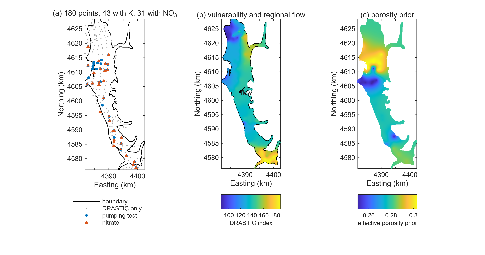
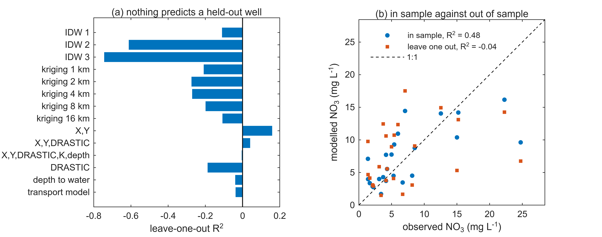
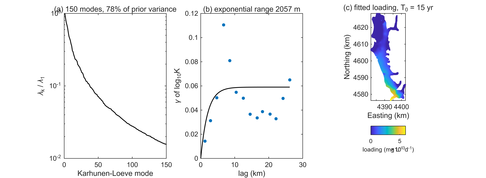
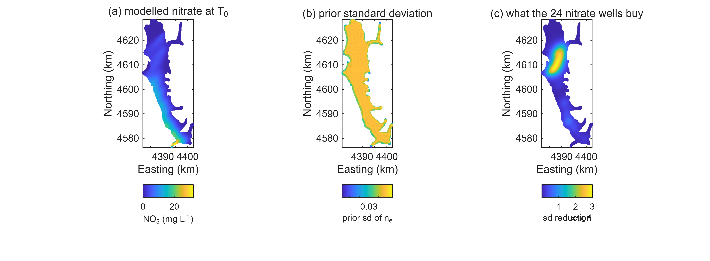
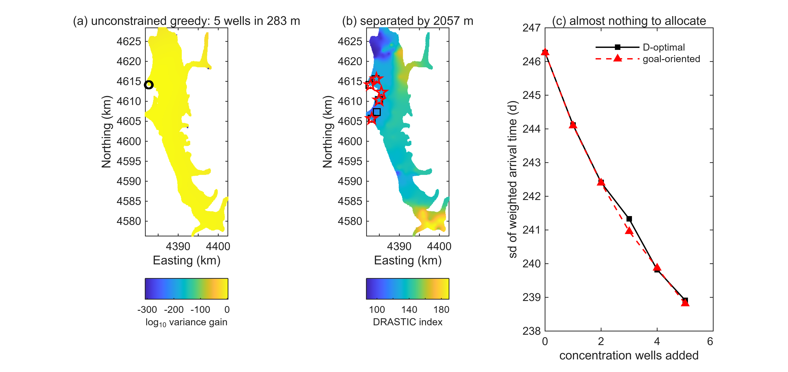
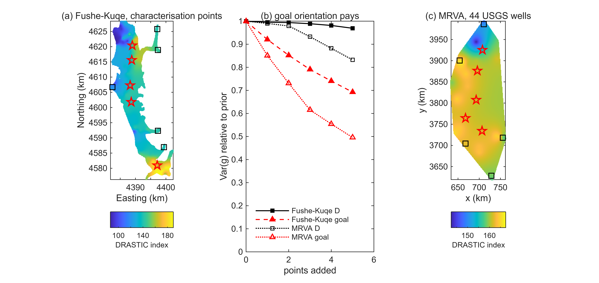
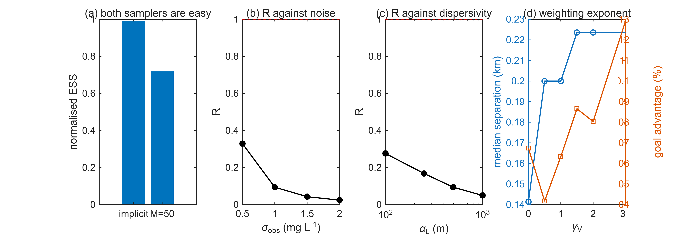
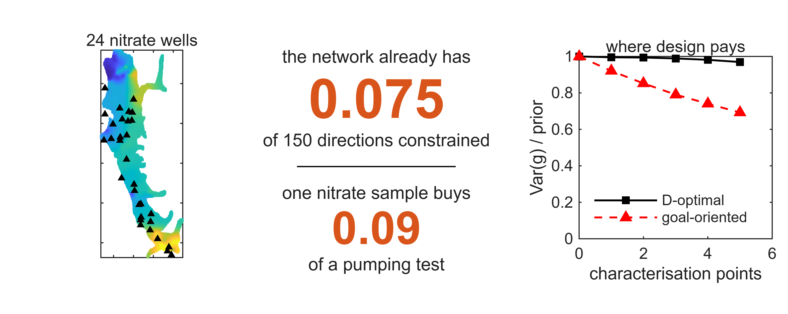

Department of Energy Resources, Faculty of Geology and Mining, Polytechnic University of Tirana, Rruga e Elbasanit, Tirana 1001, Albania

Correspondence: dulian.zeqiraj@fgjm.edu.al

## Highlights

- On a 24-well nitrate snapshot no interpolator beats the network mean out of sample
- {{n_inside_NO3}} nitrate wells constrain {{dofs}} of one direction in a {{n_modes}}-mode porosity field
- For porosity, one optimally sited nitrate sample is worth {{R_equiv}} of a pumping test
- Weighting the parameter space leaves D-optimal sites unchanged, which is proved
- Goal orientation cuts the targeted variance {{loc_ratio}} times further than D-optimality

## Abstract

Monitoring networks are extended where drilling is convenient and the value of the resulting data is asserted rather than computed. This paper computes it for the Fushë-Kuqe alluvial aquifer in northwestern Albania, a network of {{n_total}} points of which {{n_K}} carry a pumping-test hydraulic conductivity and {{n_NO3}} a nitrate concentration. Four results follow. First, the nitrate field is not predictable at this density: inverse-distance weighting at three exponents, ordinary kriging at five correlation lengths and five linear models all fail to beat the network mean under leave-one-out cross-validation, the best reaching $R^2 =$ {{best_pred_R2}}; a transient transport model with a loading field estimated from the data reaches {{cal_R2}} in sample and {{cal_loo_R2}} out of sample. Second, this is a property of the physics, not a modelling failure. Under a uniform regional Darcy flux, effective porosity cancels between the seepage velocity and the mechanical dispersion coefficient, so a steady concentration field is blind to it; only the transient carries information, and here the {{n_inside_NO3}} nitrate wells constrain the equivalent of {{dofs}} of one direction in a {{n_modes}}-dimensional parameter space, supplying {{info_gain}} nats. Third, a corollary drawn in recent work on this aquifer, that one concentration observation is worth about three pumping tests, comes out inverted when it is computed from the prior and the forward operator rather than argued from kernel extent: the factor is {{R_equiv}}, stable at {{sw_R_sigma_range}} across the measurement errors tested. Fourth, where design does pay, goal orientation is what makes it pay. Weighting the parameter space by vulnerability leaves the classical D-optimal site unchanged for any weighting, which is proved in two lines; targeting instead the variance of the vulnerability-weighted contaminant arrival time reduces that variance by {{loc_goal_pct}} against {{loc_D_pct}} for D-optimality, with sites a median {{loc_sep_km}} km apart. The same divergence is reproduced on {{mrva_n}} public USGS wells of the Mississippi River Valley alluvial aquifer. Code and data are released in full.

**Keywords:** optimal experimental design; Fisher information; monitoring network; effective porosity; DRASTIC vulnerability; alluvial aquifer; cross-validation

## 1. Introduction

### 1.1 The value of a monitoring well is rarely computed

Regional groundwater monitoring networks grow by accretion. Wells are added where access is easy, where a utility already owns land, or where an earlier campaign left a borehole, and the information content of the resulting network is discussed qualitatively if at all. The theory needed to do better is old. Lindley (1956) supplied the measure, Fedorov (1972) and Pukelsheim (2006) the design criteria, Chaloner and Verdinelli (1995) the Bayesian synthesis. Hydrogeology has had task-driven and geostatistical versions for two decades (Herrera and Pinder, 2005; Nowak et al., 2010; Leube et al., 2012), and the infinite-dimensional Bayesian treatment is now well developed (Alexanderian, 2021), including goal-oriented variants (Attia et al., 2018). What remains uncommon is a computation on a real network that answers, in units a manager recognises, what the data already in hand are worth and where the next well should go.

This paper is that computation for one aquifer. Its first result is negative, and the negative result is what makes the rest worth doing.

### 1.2 A claim worth checking

Recent work on this aquifer coupled DRASTIC vulnerability assessment to a Biased Global Random Walk transport model and reported nitrate prediction at $R^2 = 0.868$ against 564 space-time measurements spanning 300 days (Zeqiraj et al., 2026); a companion study developed a correlation-aware fusion of two porosity estimation pathways (Zeqiraj and Beqiraj, 2026).

A note on what can and cannot be compared. The field record available for the present study is a single snapshot: {{n_NO3}} nitrate values with no time dimension, ranging {{NO3_min}} to {{NO3_max}} mg L⁻¹ with a mean of {{NO3_mean}}. That is not the evidence base behind the 564 space-time measurements, and this paper makes no claim about the validity of a number computed on data it does not hold. What it does claim concerns the snapshot, and concerns a corollary drawn from that earlier work which is a statement about physics rather than about any particular dataset: because a concentration measurement integrates along a transport path while a pumping test samples a radius of influence, one well-placed concentration observation was argued to be worth roughly three additional pumping tests.

That corollary is testable from the prior and the forward operator alone, without any concentration data at all, and it is what Section 6.4 computes. It comes out inverted.

### 1.3 Contributions

1. A cross-validated assessment of what a 24-well nitrate snapshot predicts, benchmarked against interpolators that assume no physics at all. This is the control that decides whether a poor fit is the model's fault or the data's, and it is the step whose absence makes an in-sample $R^2$ misleading.
2. An identifiability statement with its magnitude. Under a uniform regional flux the steady concentration field does not depend on effective porosity, because porosity cancels between the seepage velocity and the mechanical dispersion coefficient. Identifiability lives in the transient, and how much of it there is on these data is computed rather than asserted.
3. A negative result about weighted design criteria. Reweighting the parameter space by a vulnerability field, by any weighting whatever, leaves the D-optimal site unchanged. Criteria proposed in the form of a vulnerability-weighted D-optimality therefore cannot do what they are meant to do. The proof is two lines.
4. A criterion that does work in its place: goal orientation on the vulnerability-weighted contaminant arrival time, with a closed-form rank-one gain, and two diagnostics computed on the real sensitivity kernels, an information horizon and a redundancy measure.
5. A computed information-equivalence factor between a concentration observation and a pumping test, with a sensitivity analysis over every assumption it depends on.
6. A reported pathology of greedy design on smooth information fields, and the constraint that removes it.
7. An independent replication on a public USGS dataset from another continent.

Everything is released as one reproducible package (Section 10).

## 2. Study area and data

### 2.1 The aquifer

The Fushë-Kuqe aquifer occupies the coastal plain of the Mat river in northwestern Albania. The primary hydrogeological description (Cenameri and Beqiraj, 2016) gives a confined multilayer alluvial system recharged by bed infiltration from the Mat in the north and the Droja in the south, discharging to the Adriatic along its western margin, with regional groundwater flow from northeast to southwest and a seawater wedge advancing in the opposite sense. The gravel and sand framework thickens from 5 to 10 m in the east to 180 to 200 m in the west beneath a silt and clay cover of 30 to 40 m, reaching about 270 m of alluvium in the Mat delta. Roughly 15 per cent of the upper aquifer carries a measurable seawater fraction, up to about 5.5 per cent near the coast.

Two features of that description matter here. The flow direction is a single regional azimuth, northeast to southwest, not the rotating field used in some earlier treatments of the same system. And the aquifer is confined and layered, so the depth-averaged two-dimensional representation used below is an idealisation that has to be declared rather than assumed away.

### 2.2 What the field workbook contains

One workbook, compiled from Albanian Geological Survey and IGJEUM records, holds {{n_total}} monitoring points with Gauss-Krüger coordinates (Krasovsky 1940, zone 4) and a DRASTIC index for every one; {{n_inside}} of them fall inside a {{n_boundary}}-vertex digitised boundary enclosing {{area_poly}} km². Of the {{n_total}} points, {{n_K}} carry a pumping-test hydraulic conductivity together with depth to water, a lithological description, a soil class and a vadose-zone class, and {{n_NO3}} carry a nitrate concentration. Every well with nitrate also has a conductivity. Inside the boundary there are {{n_inside_K}} wells with conductivity and {{n_inside_NO3}} with nitrate.

Figure 1 maps the system and Table 1 gives the inventory. Conductivity runs from {{K_min}} to {{K_max}} m d⁻¹, mean {{K_mean}}, standard deviation {{K_sd}}. Nitrate runs from {{NO3_min}} to {{NO3_max}} mg L⁻¹, mean {{NO3_mean}}, standard deviation {{NO3_sd}}, below the 50 mg L⁻¹ European limit everywhere but well above a natural background. DRASTIC indices run from {{DR_min}} to {{DR_max}}, mean {{DR_mean}}.

**Table 1.** What the field workbook holds. Every entry is read from the file by `fk_load_data.m` and printed at the start of every run.

{{TABLE_INVENTORY}}

### 2.3 What it does not contain, and one thing it contradicts

Three absences shape the method. There is no laboratory determination of effective porosity anywhere in the dataset, which is why the porosity prior is imported rather than derived (Section 4.1). There is no digital elevation model, and the column recording water level is a depth below ground rather than a head, so a hydraulic gradient cannot be obtained from the workbook and has to be derived from a published mean seepage velocity. And there is no time series of nitrate: every concentration is a single sample.

One contradiction governs a modelling choice and is therefore reported rather than smoothed over. The lithological descriptor attached to the {{n_K}} conductivity wells sorts them into coarse, medium and fine gravel with {{facies_c}}, {{facies_m}} and {{facies_f}} members. Those three groups are statistically indistinguishable in conductivity: one-way analysis of variance gives $\eta^2 =$ {{eta2}}, $F$({{df1}},{{df2}}) $=$ {{Fstat}}, $p =$ {{pval}}. Fine gravel includes wells at 200 m d⁻¹ and coarse gravel a well at 50 m d⁻¹. Facies-keyed parameter assignment, which published treatments of this aquifer use, is therefore not supported by this workbook, and the prior of Section 4.1 is keyed instead on the measurement that does discriminate.

### 2.4 An independent public dataset

For replication the study uses {{mrva_n}} wells of the Mississippi Alluvial Plain with hydraulic conductivity and transmissivity from slug tests (Pugh, 2023), to which DRASTIC ratings have been attached. Conductivity there spans {{mrva_K_min}} to {{mrva_K_max}} m d⁻¹, mean {{mrva_K_mean}}, an order of magnitude below Fushë-Kuqe, and DRASTIC indices {{mrva_V_min}} to {{mrva_V_max}}. Every DRASTIC index is recomputed in the code from its seven ratings and the standard weights, and the run aborts if any fails to reproduce; {{mrva_mismatch}} failed.

## 3. Is the nitrate field predictable at all?

Before a transport model is judged on how well it reproduces measured nitrate, the same question has to be put to methods that assume no physics. If simple interpolation cannot predict a withheld well, no transport model can be expected to, and a good in-sample fit then measures only the number of parameters.

Leave-one-out cross-validation was run on the {{n_inside_NO3}} nitrate wells inside the boundary for inverse-distance weighting at three exponents, ordinary kriging with an exponential variogram at five correlation lengths from 1 to 16 km, and five linear regressions on the available covariates. The criterion is the coefficient of determination against the honest baseline, the network mean.

Every interpolator is worse than the mean (Table 2, Figure 2a). Kriging gives $R^2$ between {{krig_min}} and {{krig_max}} across the whole range of correlation lengths, inverse-distance weighting between {{idw_min}} and {{idw_max}}, and the DRASTIC index alone {{lin_drastic}}. The only method that beats the mean is a plain linear trend in easting and northing, at {{lin_xy}}, and adding DRASTIC to that trend makes it worse.

**Table 2.** Leave-one-out cross-validation on the {{n_inside_NO3}} nitrate wells inside the aquifer boundary. The baseline is the network mean, whose $R^2$ is zero by construction; a negative value means the method is worse than quoting the mean.

{{TABLE_LOO}}

The reason is visible in the correlations. Nitrate correlates with northing at {{corr_north}} and with the along-flow coordinate at {{corr_along}}, but with the DRASTIC index at only {{corr_drastic}} and with conductivity at {{corr_K}}. The field is organised by where nitrogen enters, and at a mean well spacing of kilometres the pattern of entry is not resolved.

This is the fact the rest of the paper rests on. It says nothing about a model fitted to a longer record; it says that on the snapshot in hand, an in-sample fit is the only kind of fit available, and a transport model evaluated only in sample on data of this density has not been tested.

## 4. Bayesian framework

### 4.1 The porosity prior is imported, not re-derived

The Dual-Pathway fusion of lithological and hydraulic porosity estimates for this aquifer is already published together with its correlation-aware variance (Zeqiraj et al., 2026; Zeqiraj and Beqiraj, 2026). This paper consumes that result rather than repeating it. Two numbers are taken from it: a network mean effective porosity of {{ne_mean}} and a network range of 0.22 to 0.35.

Because the lithological label does not discriminate conductivity in this dataset, the spatial pattern of the prior mean is keyed on $\log_{10} K$,

$$ n_e^{\text{prior}}(x_i) = \bar{n}_e + s_n \frac{\log_{10}K_i - \overline{\log_{10}K}}{\operatorname{sd}(\log_{10}K)}, $$

clipped to the published range, with $\bar{n}_e =$ {{ne_mean}} and $s_n =$ {{ne_sd}}, the latter the published range read as a $\pm 3.2$ standard deviation span over a {{n_K}}-well network. Nothing in this construction is fitted to any result of the present paper.

The prior standard deviation follows the correlation-aware combination of the cited work. Under independent pathway errors the fused standard deviation is {{sd_iv}}; with the published facies correlations 0.15, 0.35 and 0.58 it becomes {{sd_c}}, {{sd_m}} and {{sd_f}}. Since the facies labels do not separate this dataset, the intermediate value {{sd_used}} is used throughout, and ignoring the correlation would understate the prior spread by {{sd_inflation}} per cent.

The spatial structure comes from the measurement that samples the facies architecture directly (Figure 3b). An exponential variogram fitted by weighted least squares to the {{n_K}} measured $\log_{10}K$ values gives a nugget of {{nugget}}, a partial sill of {{sill}} and a range of {{vrange}} m. The prior covariance is $B(x,x') = \sigma(x)\sigma(x')\exp(-|x-x'|/\ell)$ with $\ell$ that range, and the porosity field is expanded in its Karhunen-Loève basis,

$$ n_e(x) = n_e^{\text{prior}}(x) + \sum_{k=1}^{m}\theta_k\phi_k(x), \qquad \theta\sim\mathcal{N}(0,\operatorname{diag}\lambda), $$

truncated at $m =$ {{n_kl}} modes holding {{kl_var}} per cent of the prior variance, the basis built by the Nyström method on a strided subset of the active cells.

### 4.2 Why porosity is invisible at steady state

The domain is discretised on a grid aligned with the regional flow azimuth, which makes the dispersion tensor diagonal in grid coordinates and removes the cross-derivative terms. The grid has {{nx}} by {{ny}} cells of {{dx}} m with {{n_active}} active, covering {{area_grid}} km² against {{area_poly}} km² for the digitised polygon. Advection is first-order upwind, whose numerical dispersion is equivalent to a dispersivity of half a cell, 50 m, or a tenth of the baseline $\alpha_L$. The dispersivity sweep of Section 6.8 spans several times that error, so the conclusions do not rest on the discretisation.

The gradient is not measurable from the workbook and is derived from the published mean seepage velocity of 2.1 m d⁻¹ and the measured mean conductivity, $i = v\bar{n}_e/\bar{K} =$ {{gradient}}, giving a uniform regional Darcy flux $q_0 =$ {{q0}} m d⁻¹. The depth-averaged transport equation is

$$ n_e\frac{\partial C}{\partial t} + q_0\frac{\partial C}{\partial\xi} = \frac{\partial}{\partial\xi}\!\left(\alpha_L q_0\Gamma\frac{\partial C}{\partial\xi}\right) + \frac{\partial}{\partial\eta}\!\left(\alpha_T q_0\Gamma\frac{\partial C}{\partial\eta}\right) + m_s(x), $$

with $\xi$ and $\eta$ the along- and across-flow coordinates and $\Gamma(x)$ the DRASTIC amplification of dispersion published for this aquifer, here between {{gam_min}} and {{gam_max}}.

Written this way the identifiability question answers itself. The seepage velocity is $v = q_0/n_e$ and the mechanical dispersion coefficient is $D_L = \alpha_L v$, so the product $n_e D_L = \alpha_L q_0$ contains no porosity, and neither does the advective term once the flux rather than the velocity is taken uniform. Effective porosity survives only in the storage term. At steady state that term vanishes and the concentration field is blind to porosity. What porosity controls is how far a front has moved in a given time.

The transient is physically warranted here. At the published mean seepage velocity a traverse of the aquifer takes of the order of half a century, comparable with the history of intensive agricultural nitrogen loading, so the nitrate field cannot be assumed to have equilibrated.

### 4.3 The loading field is estimated, not assumed

A first attempt fixed the spatial shape of the loading to a power of the DRASTIC index and fitted one amplitude and one onset time. It failed. Across the eight exponents from 0 to 3 the best in-sample $R^2$ was {{null_R2}}, at exponent {{null_kappa}}. The reason is the one Section 3 gives: the nitrate pattern follows position, not vulnerability, so a loading shape fixed a priori by vulnerability cannot reproduce it.

The loading is therefore expanded in a small set of large-scale spatial functions,

$$ m_s(x) = \sum_j\beta_j\psi_j(x), \qquad \psi\in\{1,\ \xi,\ \eta,\ \xi^2,\ \eta^2,\ \xi\eta,\ V\}, $$

with $\xi$, $\eta$ and the DRASTIC index $V$ normalised to $[-1,1]$. The transport equation is linear in the source, so the response to each basis function is computed once; it is autonomous with a constant source, so one march at fixed step gives the solution at every candidate onset time. The coefficients then follow from linear least squares at each onset time and the search reduces to a scan. Where least squares drives the loading negative, over {{frac_neg}} of the domain, it is clipped and the amplitude refitted on the clipped shape, which is what the reported fit uses.

### 4.4 Fisher information and an exact discrete Jacobian

Differentiating the discrete transport system with respect to $\theta_k$ gives

$$ \left(\frac{M}{\Delta t}+A\right)C_k^{n} = \frac{M}{\Delta t}C_k^{n-1} - \operatorname{diag}(\phi_k V_{\text{cell}})\frac{C^{n}-C^{n-1}}{\Delta t}, $$

the same left-hand side as the base march. One sparse factorisation therefore serves the base solve and all {{n_kl}} modes, and the result is the exact derivative of the discrete system rather than a finite difference. Checked against finite differences at three step sizes the residual falls as a power {{fd_order}} of the step, reaching {{fd_check}} at the smallest, which is the behaviour a correct derivative has and a coincidence does not.

The Fisher information decomposes additively,

$$ I_{\text{total}} = \underbrace{\operatorname{diag}(1/\lambda)}_{I_{\text{prior}}} + \underbrace{\sigma_{\text{obs}}^{-2}J^{\top}J}_{I_{\text{obs}}}, $$

and the posterior covariance is $\Sigma = I_{\text{total}}^{-1}$.

## 5. Design criteria

### 5.1 Weighting the parameter space does nothing to D-optimality

A recurring proposal is to weight a design criterion by a vulnerability field so that the design prefers vulnerable ground. For D-optimality this cannot work, and the reason is worth stating precisely because the construction looks reasonable.

**Proposition 1.** Let $W$ be any fixed symmetric positive-definite weighting of the parameter space and let $\psi = W^{1/2}\theta$. The site maximising the D-optimal gain is the same under $\theta$ and under $\psi$.

*Proof.* Under the reparameterisation $I_\psi = W^{-1/2}IW^{-1/2}$ and $J_\psi(x) = J(x)W^{-1/2}$, so
$$ \log\det\!\left(I_\psi+\sigma^{-2}J_\psi^{\top}J_\psi\right) = \log\det\!\left(I+\sigma^{-2}J^{\top}J\right) - \log\det W, $$
and the second term does not depend on $x$. The argmax is unchanged. $\square$

By the matrix determinant lemma the classical gain from one observation is

$$ \Delta_D(x) = \log\!\left(1+\sigma_{\text{obs}}^{-2}J(x)\Sigma J(x)^{\top}\right), $$

and the set function $A\mapsto\log\det(I_{\text{prior}}+\sigma^{-2}\sum_{a\in A}J_a^{\top}J_a)$ is monotone and submodular, so greedy selection carries the $(1-1/e)$ guarantee of Nemhauser et al. (1978), as exploited for sensor placement by Krause et al. (2008).

### 5.2 Goal orientation does change the design

What a protection-zone delineation depends on is not the porosity field but the time a contaminant takes to reach the discharge boundary, and it depends on that most where the aquifer is vulnerable. With a uniform flux the residual travel time from $x$ is $\tau(x) = L(x)n_e(x)/q_0$ with $L(x)$ the remaining distance along the flow direction, so a porosity error maps linearly onto an arrival-time error. Define the vulnerability-weighted mean arrival-time error

$$ g(\theta) = \frac{\sum_x w(x)L(x)\,\delta n_e(x)}{q_0\sum_x w(x)} = c^{\top}\theta, \qquad w(x) = \left(\frac{V(x)}{\bar V}\right)^{\gamma_V}, $$

a linear functional with $c = \Phi^{\top}(wL)/(q_0\sum w)$. The design minimises $\operatorname{Var}(g) = c^{\top}\Sigma c$.

**Proposition 2.** One observation at $x$ reduces that variance by
$$ \Delta_g(x) = \frac{\sigma_{\text{obs}}^{-2}\left(c^{\top}\Sigma J(x)^{\top}\right)^{2}}{1+\sigma_{\text{obs}}^{-2}J(x)\Sigma J(x)^{\top}}. $$

*Proof.* Sherman-Morrison applied to $\Sigma^{+} = (\Sigma^{-1}+\sigma^{-2}J^{\top}J)^{-1}$ gives $c^{\top}\Sigma^{+}c = c^{\top}\Sigma c - (c^{\top}\Sigma J^{\top})^{2}/(\sigma^{2}+J\Sigma J^{\top})$. $\square$

Goal-oriented design in this sense is established in the inverse-problems literature (Attia et al., 2018) and has been applied to variable-density seawater intrusion in a companion preprint (Zeqiraj, 2026), where the objective is an adjoint expected information gain rather than a linear-functional variance. Unlike Proposition 1 this criterion is not invariant to the weighting: $c$ enters the numerator and a different $w$ selects a different direction in parameter space. Submodularity is a property of the log-determinant and is not claimed here; the greedy sequence is a heuristic and is reported as one.

### 5.3 Two diagnostics, and a pathology they expose

The prior covariance between the concentration at $x$ and the porosity elsewhere,
$$ \kappa_x(x') = \sum_k\lambda_k J(x,k)\phi_k(x'), $$
is the kernel through which one observation sees the field. Its **information horizon** is the radius holding {{horizon_frac}} per cent of its absolute mass. The **information correlation** between two candidate sites,
$$ r_{\text{info}}(x_1,x_2) = \frac{J(x_1)\Sigma J(x_2)^{\top}}{\sqrt{J(x_1)\Sigma J(x_1)^{\top}\,J(x_2)\Sigma J(x_2)^{\top}}}, $$
measures their redundancy.

The second diagnostic exposes a failure of greedy design that is not usually reported, and points at the scale that fixes it. On a {{dx}} m grid whose information field varies over kilometres, the rank-one update at a chosen cell removes so little of the information at its neighbours that the next choice is the neighbour itself. Run without a constraint, the greedy D-optimal sequence here places its {{n_new}} wells within {{free_span}} m of one another at a maximum pairwise information correlation of {{corr_free}}: five wells buying one well's information.

The obvious remedy is a minimum separation, and the obvious scale to use is the variogram range, {{min_sep}} m. It is not enough. Imposing it lowers the maximum pairwise correlation only to {{corr_constrained}}, still within a few per cent of complete redundancy. The scale that has to be forbidden is the information horizon, {{horizon_med}} m here, which is {{horizon_over_range}} times the variogram range; imposing that lowers the maximum pairwise correlation to {{corr_horizon}}. The reason is that redundancy between two observations is a property of the coherence of the observation kernel, not of the field: two wells inside one kernel width see the same thing however far apart the field decorrelates. Both constrained designs are reported below.

### 5.4 Concentration observation against pumping test

A pumping test constrains porosity at its own cell through the conductivity-to-porosity relation of Section 4.1, with standard deviation $\sigma_{n|K} = s_n(\sigma_K/K)/(\ln 10\ \operatorname{sd}(\log_{10}K)) =$ {{sd_pump_ne}}. Its Fisher contribution is rank one in the Karhunen-Loève basis with $\phi(x)$ in place of $J(x)$, so the same closed form applies, and the information-equivalence factor is the ratio of best achievable gains,

$$ R = \frac{\max_x\Delta_g^{\text{conc}}(x)}{\max_x\Delta_g^{\text{pump}}(x)}, $$

the number of pumping tests one optimally placed concentration observation replaces.

## 6. Results

### 6.1 What the transport model achieves

With the loading expanded as in Section 4.3 the best fit has an onset time of {{T0_yr}} years, an in-sample RMSE of {{cal_rmse}} mg L⁻¹ and $R^2 =$ {{cal_R2}}. Dropping the DRASTIC column from the loading basis changes the unconstrained in-sample $R^2$ by {{drastic_contrib}}, so vulnerability adds little once the regional trend is present. Leave-one-out cross-validation gives RMSE {{cal_loo_rmse}} mg L⁻¹ and $R^2 =$ {{cal_loo_R2}}.

The model therefore predicts a withheld well no better than the network mean, which is what Section 3 predicts for any method on these data. Eight parameters over {{n_inside_NO3}} observations is enough to fit and not enough to generalise. The in-sample number alone would have read as a success.

### 6.2 How much the existing network is worth

Figure 4 shows what the assimilation buys, and the measure to quote is the degrees of freedom for signal (Rodgers, 2000), $\operatorname{tr}(I_{\text{obs}}\Sigma)$, which counts how many directions of the parameter space the observations actually constrain. Out of {{n_modes}} retained modes it is {{dofs}}. In log-determinant terms the {{n_inside_NO3}} wells supply {{info_gain}} nats, and averaged over the retained modes the porosity standard deviation falls by {{sd_red_pct}} per cent, from {{sd_prior_mean}} to {{sd_post_mean}}.

The trace ratio used in earlier work on this aquifer gives {{frac_obs_sci}} for the observation share ({{tr_obs}} against {{tr_prior}}), and is reported here for comparability only. It should not be the headline number: the trace of the prior information is dominated by the smallest prior variances, that is by the directions the prior already pins down, so it flatters the prior by construction. The two measures agree on the conclusion.

This is the quantitative form of Section 3, and it is a stronger statement than the cross-validation. The snapshot is not merely hard to extrapolate; measured against the prior it is very nearly uninformative about the quantity it is often assumed to constrain.

### 6.3 Designing more nitrate wells does not help much

The vulnerability-weighted mean residual arrival time under the prior is {{tau_mean_yr}} years with a standard deviation of {{sd_goal_prior}} days. Five additional concentration observations, optimally placed under either criterion, reduce that standard deviation to {{sd_goal_D}} days (D-optimal) and {{sd_goal_G}} days (goal-oriented), a reduction of {{sd_goal_red_pct}} per cent. The two designs sit a median {{median_sep_m}} m apart and differ in final variance by {{goal_adv_pct}}.

Figure 5 shows both designs. Both put their wells in ground whose mean DRASTIC index is {{V_D}} and {{V_goal}} respectively, against a domain mean of {{V_domain}}: the locations where a concentration measurement is most informative about porosity are the less vulnerable ones, which is exactly the tension a goal-oriented criterion exists to resolve, and exactly the tension that cannot be resolved when there is no information to trade.

Under the wider separation constraint of one information horizon the figures are {{sd_goal_D_hor}} and {{sd_goal_G_hor}} days, so forcing the wells apart costs almost nothing here: the information being allocated is too small for its distribution to matter.

That the two criteria barely separate is not a defect of goal orientation. It follows from Section 6.2: when an observation type carries almost no information, there is almost nothing for a criterion to allocate, and every reasonable criterion returns nearly the same answer. The information horizon of a single concentration observation is {{horizon_med}} m (range {{horizon_min}} to {{horizon_max}} m), {{horizon_over_range}} times the variogram range of {{vrange}} m, which is another way of saying the same thing: the kernel is broad and flat.

### 6.4 One concentration observation is worth {{R_equiv}} pumping tests

The best single concentration observation reduces the variance of the weighted arrival time by {{gain_conc}} d², the best single pumping test by {{gain_pump}} d², giving $R =$ {{R_equiv}}.

This contradicts the factor of about three asserted for the same aquifer, and not marginally. The cause is identifiable. The earlier argument compares the spatial extent of the two sensitivity kernels and infers that the more extended one carries more information. Extent is not information. What enters the Fisher information is the squared amplitude of the kernel projected onto the directions the prior leaves uncertain, and a concentration observation in a nearly equilibrated field has a broad kernel of small amplitude. The pumping test constrains the field where it stands, with a porosity standard deviation of {{sd_pump_ne}}, and on these data that is the better buy. Section 6.8 shows $R$ stays at {{sw_R_sigma_range}} across the measurement errors tested and {{sw_R_alpha_range}} across the dispersivities, never approaching one.

### 6.5 Where design does pay

Concentration observations are not the only thing a campaign can buy. The other kind is a direct characterisation point: a cored borehole with a laboratory determination of effective porosity, or a downhole log calibrated to one. Section 2.3 noted that the present record contains none, and that is precisely why the placement question bites. A measurement that is expensive, scarce and strongly informative is the one whose siting is worth optimising; a cheap, abundant and weakly informative one is not. The operator is modelled as determining the field at its own location with standard deviation {{sd_local}}, a figure for a laboratory determination on an intact sample, and it is applied identically at both study sites so that no flow model enters the comparison.

With that operator the information is local, strong, and there is a great deal of it to allocate, and the choice of criterion matters a great deal.

At Fushë-Kuqe (Table 3, Figure 6a and 6b), five such points reduce the variance of the vulnerability-weighted mean by {{loc_D_pct}} under D-optimality and {{loc_goal_pct}} under goal orientation, a factor of {{loc_ratio}}, and the two designs sit a median {{loc_sep_m}} m apart. This is the separation Proposition 1 says cannot be obtained by weighting the D-criterion: it has to come from changing what is being estimated. Figure 6a shows where the difference comes from. The D-optimal points sit on the domain boundary, which is where a smooth Gaussian prior is least constrained and therefore where the determinant gains most; the goal-oriented points move inland, to where the vulnerability weight and the remaining travel distance are both large. Boundary attraction is a known property of determinant criteria on bounded domains, and it is exactly the behaviour a decision-relevant objective has to overcome.

### 6.6 Independent replication

On the {{mrva_n}} wells of the Mississippi River Valley alluvial aquifer (Figure 6c), with the same local observation operator applied at both sites so that no flow model enters the comparison, the divergence is reproduced and is larger: {{mrva_D_pct}} variance reduction under D-optimality against {{mrva_goal_pct}} under goal orientation, with a median separation of {{mrva_sep_km}} km. Mean DRASTIC at the chosen sites is {{mrva_V_goal}} for the goal-oriented design against {{mrva_V_D}} for the D-optimal one.

**Table 3.** Reduction in the variance of the vulnerability-weighted target under the two criteria, for {{n_new}} added observations. The first row uses the transport observation operator, which only the Albanian site supports; the last two use the local characterisation operator, which is identical at both sites.

{{TABLE_DESIGN}}

The two sites differ by an order of magnitude in conductivity and by a continent in setting, and the conclusion transfers. That is the extent of the claim. The replication tests the design comparison, not the transport model, for which the MRVA dataset holds neither a flow field nor a solute record, and none was invented.

### 6.7 Posterior sampling, and what it does not show

The Gauss-Newton minimisation reaches its minimum in {{gn_iters}} iterations. The condition number of the Gauss-Newton Hessian is {{cond_H}}. Descent to a relative Riemannian gradient of $10^{-6}$ takes {{iters_nat}} iteration under the natural gradient against {{iters_euc}} under the Euclidean gradient.

That ratio should not be read as a general acceleration factor. On a quadratic model the natural gradient with unit step is Newton's method and terminates in one step by construction, so the comparison measures the conditioning of the problem and nothing about behaviour on a genuinely nonlinear cost. The often-quoted scaling by $\sqrt{\kappa}$, here $\sqrt{\kappa} =$ {{sqrt_kappa}}, describes the Euclidean method's dependence on conditioning, not a property of the natural gradient, and the two should not be compared as though they were the same quantity.

Implicit sampling with {{M_imp}} particles attains a normalised effective sample size (Figure 7a) of {{ess_imp}}; sequential importance resampling from the prior with {{M_sir}} particles attains {{ess_sir}}. Both are high, and for the same reason the design comparison of Section 6.3 was flat: with the observation information as small as Section 6.2 finds, the posterior is close to the prior, the likelihood is nearly flat, and neither sampler is under strain. This is reported because the comparison is often presented as evidence of a method's power; on these data it is evidence of a weak likelihood.

### 6.8 Sensitivity of the conclusions

Every assumption marked as such in the configuration was varied one at a time. In the dispersivity sweep the fitted loading field and onset time are held at their baseline values, so what the sweep measures is the sensitivity of the information content to the transport parameter, not a refitting of the whole model; refitting at each dispersivity would confound the two.

Figure 7b to 7d and Table 4 collect the result. Nitrate measurement error from 0.5 to 2.0 mg L⁻¹ moves the observation share of the Fisher information over {{sw_frac_range}} and $R$ over {{sw_R_sigma_range}}. Pumping-test relative error from 5 to 20 per cent moves $R$ over {{sw_R_sigmaK_range}}. The vulnerability exponent $\gamma_V$ from 0 to 3 moves the median separation of the two transport-operator designs only over {{sw_sep_range}} m, the two criteria staying within a tenth of a per cent of each other in final variance throughout. At $\gamma_V=0$ the goal functional becomes the unweighted travel-time mean, which is still not the D-optimal objective, so a small separation remains; that it does not grow with $\gamma_V$ is the same statement as Section 6.3, that there is too little information here for any criterion to allocate differently. Longitudinal dispersivity from 100 to 1000 m moves $R$ over {{sw_R_alpha_range}}.

**Table 4.** Every assumption varied one at a time, and what moves.

{{TABLE_SWEEP}}

No tested setting produces $R>1$.

## 7. Discussion

### 7.1 What this corrects

Two things in the recent literature on this aquifer do not survive the computation, and a third needs qualifying.

The qualified one first. A nitrate prediction skill of $R^2 = 0.868$ is reported for this aquifer against 564 space-time measurements. The record available here is a snapshot of {{n_NO3}} values with no time dimension, so the two cannot be compared directly and no claim is made about that number. What can be said is what this snapshot supports: on it, nothing tested here beats the network mean out of sample, the best reaching {{best_pred_R2}}, so a model evaluated only in sample on data of this density has not been tested against the possibility that it is fitting noise.

The facies-keyed parameter assignment is not supported by the workbook it is applied to, because in that workbook the lithological label and the measured conductivity are statistically independent ($p =$ {{pval}}). This one is unqualified: it is a property of the file, checkable in one line.

The information-equivalence factor is {{R_equiv}}, not three, and its practical direction is the reverse: for constraining effective porosity in this aquifer an additional pumping test buys more than an additional nitrate sample, by about a factor of {{R_inverse}}. Nitrate sampling remains far cheaper per point and remains the right instrument for its own purposes, contaminant mapping and regulatory compliance among them. It is simply not an efficient instrument for porosity.

### 7.2 Why the negative results are the useful ones

A design calculation earns its keep where the intuition is wrong, and here the intuition that an integrating measurement must be informative fails for a reason that generalises. The Fisher information of an observation is the squared amplitude of its sensitivity projected onto the uncertain directions of the prior. A kernel can be broad and flat, sampling a large region and learning little from any of it, and a broad kernel is exactly what a regional concentration measurement in a slowly evolving plume has. The same reasoning says where concentration observations would be informative: in strongly transient plumes whose arrival time is still moving quickly. This aquifer is nearer that regime than a steady one, which is why $R$ is not smaller still.

The second negative result, Proposition 1, is of the same kind. A weighted D-criterion looks like it should express a preference for vulnerable ground and it cannot, because D-optimality is invariant to exactly that operation. Getting the preference requires changing the estimand, not the metric.

### 7.3 Limitations

The flow field is a uniform regional flux with a single azimuth. This is the strongest simplification in the paper and it is forced by the absence of a head field. A calibrated multilayer flow model would change the sensitivity kernels and could change the placement, though the separation between the two design criteria under the local operator does not depend on the flow model at all.

The transport model is depth-averaged in a system the primary source describes as confined and multilayer with a thickness varying by a factor of twenty across the domain. Vertical structure is not represented.

The onset time of loading is estimated from {{n_inside_NO3}} concentrations and is not independently constrained. It enters the porosity sensitivity directly, so the absolute magnitudes of Section 6.2 carry that uncertainty; the ratios of Sections 6.4 and 6.5 are less exposed.

The porosity prior is imported. If the published fusion is revised the prior moves and with it the posterior; the design machinery does not change.

Seawater intrusion affects roughly 15 per cent of the upper aquifer and is not represented. Chloride from the intruding wedge is a different tracer with a different source geometry, and the two chloride series available (Cenameri and Beqiraj, 2016) are too thin to constrain a field model. A variable-density treatment is the natural next step.

The goal functional is one linear functional. A vector-valued goal, for instance arrival times at several abstraction fields, would give a matrix criterion and possibly a different design.

### 7.4 What a manager should take from this

Three things, in the order they matter. The existing nitrate network should not be used to infer porosity, and a protection zone computed as though it does will be narrower than the evidence supports. If a choice must be made between one more pumping test and one more nitrate sample for the purpose of constraining transport timing, on these data the pumping test is worth about {{R_inverse}} of the nitrate samples. And when characterisation points are placed, the criterion should target the quantity the decision depends on, which on this aquifer reduces the relevant variance by a factor of {{loc_ratio}} more than the conventional criterion does.

## 8. Conclusions

1. On a {{n_inside_NO3}}-well nitrate snapshot in a {{area_poly}} km² alluvial aquifer, no interpolator and no transport model tested predicts a held-out well better than the network mean; the best leave-one-out $R^2$ reached by anything is {{best_pred_R2}}.
2. Under a uniform regional flux the steady concentration field is independent of effective porosity. Identifiability lives in the transient, and on these data the nitrate observations constrain {{dofs}} degrees of freedom out of {{n_modes}}, supplying {{info_gain}} nats.
3. One optimally placed concentration observation is worth {{R_equiv}} pumping tests for this purpose, not three, across every assumption tested.
4. Weighting the parameter space by vulnerability leaves the D-optimal site unchanged, for any weighting. Designs claiming otherwise rely on an invariance they do not have.
5. Goal orientation on the vulnerability-weighted arrival time reduces the targeted variance by a factor of {{loc_ratio}} more than D-optimality at Fushë-Kuqe and reproduces that divergence on {{mrva_n}} independent USGS wells.
6. Unconstrained greedy design on a smooth information field returns mutually redundant sites, here {{n_new}} wells within {{free_span}} m at information correlation {{corr_free}}. A minimum separation of one variogram range is not enough to break it ({{corr_constrained}}); the scale that works is the information horizon ({{corr_horizon}}).

## 9. Acknowledgements

The hydrogeological data were compiled from records of the Albanian Geological Survey and of the Institute of GeoSciences, Energy, Water and Environment at the Polytechnic University of Tirana. The Mississippi Alluvial Plain conductivity data are a public release of the U.S. Geological Survey.

## 10. Data availability

The complete package, comprising the field data in flat form, the MATLAB pipeline, the results file every number in this paper is quoted from, and the scripts that draw every figure, is at

- GitHub: {{GITHUB_URL}}
- Zenodo (archived release): {{ZENODO_DOI}}

One command reproduces everything reported here. The primary sources are cited in Section 2.

## 11. Declaration of competing interests

The author declares no competing interests.

## 12. CRediT author statement

Dulian Zeqiraj: conceptualization, methodology, software, formal analysis, investigation, data curation, writing, visualization.

## Figures

**Figure 1.** The Fushë-Kuqe aquifer. (a) The {{n_boundary}}-vertex digitised boundary with all {{n_total}} monitoring points, the {{n_K}} carrying a pumping-test conductivity and the {{n_NO3}} carrying a nitrate concentration. (b) The DRASTIC vulnerability field kriged from all {{n_total}} points, with the regional flow direction reported by Cenameri and Beqiraj (2016). (c) The effective-porosity prior, keyed on measured $\log_{10}K$ and scaled to the published network statistics.

**Figure 2.** Nothing predicts a held-out nitrate well. (a) Leave-one-out $R^2$ for every method tested, against the network-mean baseline at zero. (b) Modelled against observed nitrate, in sample and under leave-one-out, with the 1:1 line.

**Figure 3.** Prior and loading. (a) The Karhunen-Loève spectrum of the prior covariance. (b) The empirical variogram of the {{n_K}} measured $\log_{10}K$ values with the fitted exponential model. (c) The loading field estimated from the {{n_inside_NO3}} nitrate observations, with its fitted onset time.

**Figure 4.** What the existing network buys. (a) Modelled nitrate at the fitted onset time. (b) Prior standard deviation of effective porosity. (c) The reduction in that standard deviation produced by assimilating all {{n_inside_NO3}} nitrate observations, on the same colour scale.

**Figure 5.** Design with transport observations. (a) The one-shot variance gain, with the sites the unconstrained greedy sequence returns: {{n_new}} wells within {{free_span}} m. (b) The two criteria under a minimum separation of {{min_sep}} m, over the vulnerability field. (c) The standard deviation of the vulnerability-weighted arrival time against the number of wells added.

**Figure 6.** Design with characterisation points, where the criterion matters. (a) The two designs at Fushë-Kuqe over the vulnerability field. (b) Variance of the goal functional relative to its prior value, at both sites and under both criteria. (c) The {{mrva_n}} USGS wells of the Mississippi Alluvial Plain with the two designs.

**Figure 7.** Sampling and sensitivity. (a) Normalised effective sample size for implicit sampling and for sequential importance resampling from the prior. (b) The information-equivalence factor against nitrate measurement error, with unity marked. (c) The same against longitudinal dispersivity. (d) Median separation of the two designs and the goal-oriented advantage against the vulnerability exponent.

**Graphical abstract.** The {{n_inside_NO3}} nitrate wells of the network, the {{dofs}} directions of a {{n_modes}}-dimensional porosity field they constrain, and the variance reduction the two design criteria achieve when the observation is a characterisation point instead.

## References

Alexanderian, A., 2021. Optimal experimental design for infinite-dimensional Bayesian inverse problems governed by PDEs: a review. Inverse Problems 37(4), 043001. https://doi.org/10.1088/1361-6420/abe10c

Attia, A., Alexanderian, A., Saibaba, A.K., 2018. Goal-oriented optimal design of experiments for large-scale Bayesian linear inverse problems. Inverse Problems 34(9), 095009. https://doi.org/10.1088/1361-6420/aad210

Cenameri, S., Beqiraj, A., 2016. Assessment of seawater intrusion in Fushe Kuqe aquifer, Albania. Bulletin of the Geological Society of Greece 50(2), 665. https://doi.org/10.12681/bgsg.11772

Chaloner, K., Verdinelli, I., 1995. Bayesian experimental design: a review. Statistical Science 10(3), 273–304. https://doi.org/10.1214/ss/1177009939

Chorin, A.J., Morzfeld, M., Tu, X., 2010. Implicit particle filters for data assimilation. Communications in Applied Mathematics and Computational Science 5(2), 221–240. https://doi.org/10.2140/camcos.2010.5.221

Chorin, A.J., Tu, X., 2009. Implicit sampling for particle filters. Proceedings of the National Academy of Sciences 106(41), 17249–17254. https://doi.org/10.1073/pnas.0909196106

Fedorov, V.V., 1972. Theory of Optimal Experiments. Academic Press, New York.

Gelhar, L.W., Welty, C., Rehfeldt, K.R., 1992. A critical review of data on field-scale dispersion in aquifers. Water Resources Research 28(7), 1955–1974. https://doi.org/10.1029/92WR00607

Herrera, G.S., Pinder, G.F., 2005. Space-time optimization of groundwater quality sampling networks. Water Resources Research 41(12), W12407. https://doi.org/10.1029/2004WR003626

Krause, A., Singh, A., Guestrin, C., 2008. Near-optimal sensor placements in Gaussian processes: theory, efficient algorithms and empirical studies. Journal of Machine Learning Research 9(8), 235–284.

Leube, P.C., Geiges, A., Nowak, W., 2012. Bayesian assessment of the expected data impact on prediction confidence in optimal sampling design. Water Resources Research 48(2), W02501. https://doi.org/10.1029/2010WR010137

Lindley, D.V., 1956. On a measure of the information provided by an experiment. The Annals of Mathematical Statistics 27(4), 986–1005. https://doi.org/10.1214/aoms/1177728069

Morzfeld, M., Tu, X., Atkins, E., Chorin, A.J., 2012. A random map implementation of implicit filters. Journal of Computational Physics 231(4), 2049–2066. https://doi.org/10.1016/j.jcp.2011.11.022

Nemhauser, G.L., Wolsey, L.A., Fisher, M.L., 1978. An analysis of approximations for maximizing submodular set functions. Mathematical Programming 14(1), 265–294. https://doi.org/10.1007/BF01588971

Nowak, W., de Barros, F.P.J., Rubin, Y., 2010. Bayesian geostatistical design: task-driven optimal site investigation when the geostatistical model is uncertain. Water Resources Research 46(3), W03535. https://doi.org/10.1029/2009WR008312

Pugh, A.L., 2023. Hydraulic conductivity and transmissivity estimates from slug tests in wells within the Mississippi Alluvial Plain, Arkansas and Mississippi, 2020. U.S. Geological Survey Scientific Investigations Report 2023-5101. https://doi.org/10.3133/sir20235101

Pukelsheim, F., 2006. Optimal Design of Experiments. Society for Industrial and Applied Mathematics, Philadelphia. https://doi.org/10.1137/1.9780898719109

Rodgers, C.D., 2000. Inverse Methods for Atmospheric Sounding: Theory and Practice. World Scientific, Singapore. https://doi.org/10.1142/3171

Zeqiraj, D., 2026. Goal-oriented Bayesian experimental design for variable-density seawater intrusion: adjoint expected information gain for joint monitoring and managed-aquifer-recharge placement. Preprint, SSRN. https://doi.org/10.2139/ssrn.6866554

Zeqiraj, D., Beqiraj, A., 2026. Adaptive stacked ensemble fusion: Bayesian porosity inference in alluvial aquifers when the errors are not independent. Journal of Contaminant Hydrology 283, 105086. https://doi.org/10.1016/j.jconhyd.2026.105086

Zeqiraj, D., Beqiraj, A., Jahja, A., Seitaj, B., Progni, F., Zeqo, E., 2026. Physical, biophysical, and chemical mechanisms of bidirectional coupling between DRASTIC vulnerability assessment and numerical transport modeling in heterogeneous aquifer systems. Journal of Hazardous Materials Advances 23, 101261. https://doi.org/10.1016/j.hazadv.2026.101261
